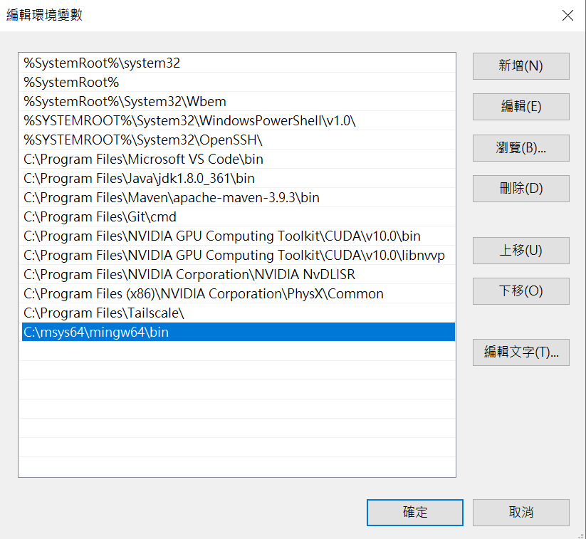

# C++ Hellow World

## **目錄**
---
1. [C++ 特性與差別](#1-c-特性與差別)
2. [C++ 開發環境安裝](#2-c-開發環境安裝)
3. [C++ 基礎輸入輸出](#3-c-基礎輸入輸出)
4. [C++ 變數、關鍵字、運算符](#4-c-變數關鍵字運算符)
---  
<br/>  

## **1. C++ 特性與差別**  
1. _**機器獨立**_  
C/C++ 語言程序可以在許多機器中執行，不過依然有一點點變化。因此它不是平臺無關的。
2.  _**運行速度快**_  
C++ 語言的編譯和執行時間都非常快。
3. _**指針功能**_  
C++ 提供指針的功能。可以通過使用指針直接與記憶體互動。且可以使用記憶體、結構、函數、數組等指針。
4. _**記憶體管理**_  
它支持動態記憶體分配的特性。在 C++ 語言中，可以通過調用 delete() 函數隨時釋放分配的記憶體。
5. _**豐富程序庫**_  
C++ 提供了許多內建函數（程式庫），一些常用的功能不用再去重頭開始編寫，有助於提高開發速度。
6. _**高可擴展性**_  
C++ 語言是可擴展的，因爲它可以比較容易地採用新的功能。
7. _**物件導向**_  
C++ 是物件導向的程式（OOP）語言。OOP 使開發和維護變得更容易，因爲在物件導向的程式語言中，如果程式碼隨著項目規模的增長而增長，就不容易管理。
8. _**C 與 C++ 差異：**_  
    + **定義**：  
    C 是一種結構化編程語言，它不支持類和對象，而 C++ 是一種支持類和對象概念的物件導向的程式語言。
    + **子集**：  
    C++ 是 C 編程語言的超集。C++ 可以運行99％的 C 程式碼，但 C 語言不能運行 C++ 程式碼。
    + **異常處理**：  
    C 不直接提供對異常處理的支持，它需要使用支持異常處理的功能。C++通過使用 try-catch 直接提供了對異常處理的支持。
    + **記憶體分配和取消分配**：  
    C 支持 calloc() 和 malloc() 函數進行記憶體分配，並支持 free() 函數進行內存分配。C ++支持用於記憶體分配的 new 運算符和用於記憶體取消分配的delete運算符。
    + **參考變量（[Reference](https://openhome.cc/Gossip/CppGossip/Reference.html)）**：  
    C 語言不支持參考變量，而 C++ 支持參考變量。
    + **安全性**：  
    在 C 語言中，函數和數據是自由實體，在 C++ 語言中，所有函數和數據都以物件形式封裝。
    + **繼承（Inheritance）**：  
    C 語言不支持繼承，而 C++ 支持繼承。
    + **函數覆蓋（Override）**：  
    C 語言不支持功能覆蓋，而 C++ 支持功能覆蓋。
    + **函數重載（Overload）**：  
    C 語言不支持函數重載，而 C++ 支持函數重載。

<hr/>

## **2. C++ 開發環境安裝**
本文採用 [C/C++ for Visual Studio Code](https://code.visualstudio.com/docs/languages/cpp) 進行安裝。  
首先先於 Visual Studio Code 安裝 C/C++ 套件，如下圖所示。


由於此套件不包含 C++ 編譯器（Compiler）以及除錯器（Debugger），因此需額外安裝。Windows 用戶可透過 [MinGW installer](https://github.com/msys2/msys2-installer/releases/download/2023-05-26/msys2-x86_64-20230526.exe) 進行安裝，它提供最新的 GCC 編譯器以及其他 C++ 工具和函式庫等。  

安裝成功後點擊執行，並執行下列指令：  
`pacman -S --needed base-devel mingw-w64-x86_64-toolchain`  
執行後輸入空白鍵以及 `Y` 來安裝全部工具。
  

接著，如果安裝時選擇預設安裝位置，將路經 `C:\msys64\mingw64\bin` 新增至環境變數中。


最後，開啟終端機輸入 `gcc --version` 和 `g++ --version` 以及 `gdb --version` 來測試是否正確安裝
<hr/>

## **3. C++ 基礎輸入輸出**
C++ 中的 I/O 操作使用流概念。如果字串從主存儲器流向設備，如：打印機、顯示器或網絡連接等，則稱爲**輸出流**。反之，如果字串從打印機、顯示器或網絡連接等設備流向主存儲器，則稱爲**輸入流**。  

下列是 C++ 中常見的公共頭文件：
1. **\<iostream\>**：它用於定義 cout，cin 和 cerr 對象，分別對應於標準輸出流，標準輸入流和標準錯誤流。  
2. **[\<iomanip\>](https://www.twblogs.net/a/5b8d9d3d2b717718833f60fd)**：它用於讓使用者得以格式化輸入輸出，如：setprecision 和 setw 等等。
3. **[\<fstream\>](https://blog.csdn.net/Jaster_wisdom/article/details/52400059)**：它用於讓使用者得以控制文件相關處理。  
```c++
#include <iostream>  
using namespace std;  
int main( ) {  
  int age;  
   cout << "Enter your age: ";  
   cin >> age;  
   cout << "Your age is: " << age << endl;  
}
```
<hr/>

## **4. C++ 變數、關鍵字、運算符**  
C++ 變數命名時不可以使用數字作為開頭，也不可以使用一些特殊字元（如 *&^% 等字元），同時也不可以與 C++ 內定的關鍵字同名。

C++ 宣告變數時，會根據其資料型態在記憶體中配置空間。同時如果是非區域變數時，變數預設為對應型態的初始值，但當屬於區域變數時，變數如未初始化，其值為不可預期。

C++ 可使用以下的建構子（Constructor）方式將變數的值初始為各型態的零值，或者使用[清單初始化（list initialization）](https://en.cppreference.com/w/cpp/language/list_initialization)，其目的在統一初始化的方式，對於基本型態，也可以使用同一種風格來初始化。
```c++
int ageForStudent = int();
double scoreForStudent = double();
char levelForStudent = char();

int ageForStudent{0};
double scoreForStudent{0.0};
char levelForStudent{'A'};
```

C++ 若變數宣告後有明確地初始化，可以使用 auto 讓編譯器推斷變數型態。但當只用 auto 卻沒有初始，會發生編譯錯誤。
```c++
auto ageForStudent = 5; 
auto scoreForStudent = 80.0; 
auto levelForStudent = 'B'; 
auto ageForStudent; // error: declaration of 'auto ageForStudent' has no initializer
```

C++ 有以下幾種資料類型：
1. 基本數據類型（Basic）：
    + bool（1 byte）
    + char（1 byte）
    + short（2 byte）
    + int（4 byte）
    + long（4 byte）
    + float（4 byte）
    + double（8 byte）
2. 派生數據類型（Derived）：數組, 指針等
3. 枚舉數據類型（Enumeration）：枚舉(enum)
4. 用戶定義的數據類型（User Defined）：結構體
<hr/>

C++ 使用 const 關鍵字來限定時，如果程式中有其他程式碼試圖改變這個變數，編譯器會檢查出這個錯誤。也可以使用 constexpr 請編譯器驗證常數初始時是否是在編譯時期決定，否則報錯。
```c++
constexpr int A = 10;
constexpr int B = sizeof(10);
constexpr int C = sizeof(B);
constexpr int D = rand();    // error: call to non-'constexpr' function 'int rand()'
```

C++ 如果要宣告無號整數變數，可以加上 unsigned 關鍵字：
```c++
unsigned int i ;
```

C++ 中共有32個關鍵字：
> auto, break, case, char, const, continue, default, do, double, else, enum, extern, float, for, goto, if, int, long, register, return, short, signed, sizeof, static, struct, switch, typedef, union, unsigned, void, volatile, while
<hr/>  

C++ 提供算術相關的加（+）、減（-）、乘（*）、除（/） 以及餘除運算子（%）或稱模數（Modulus）運算子，這類以數學運算為主的運算子，稱為「算術運算子」（Arithmetic operator）。

在 C++ 中為了避免因為無差別地強制轉換型態（例如將 Dog 類別指標轉為 Cat 類別指標），可能導致執行時期錯誤或不可預期的結果，因此定義了四種用於不同場合的具名轉型（named casting）：  
+ static_cast：主要用於算術運算時的顯式轉換
    ```c++
    int a = 10;
    int b = 3;
    cout << static_cast<double>(a) / b; // 顯示 3.33333
    ```
+ const_cast：此並不會允許你更對常數值，但可以使你可以調用參數為 non-const 的函數（前提是此函數不會對值進行改動）
    ```c++
    const double PI = 3.14159;
    double *pi = const_cast<double*>(&PI); 

    void InputInt(int * num)
    {
        cout<<*num<<endl;
    }
    int main()
    {
        const int constant = 21;
        //InputInt(constant); //error C2664: “InputInt”: 不能將參數 1 從"const int"轉換為"int *"
        InputInt(const_cast<int*>(&constant));
        system("pause");
    }
    ```
+ reinterpret_cast：如果只希望儲存位址而不關心型態，可以使用 void* 來宣告指標，也因此不可以使用 * 運算子對 void* 型態指標提取值，編譯器也不會允許將 void* 指標直接指定給具有型態資訊的指標，必須使用 reinterpret_cast 明確告知編譯器，這個動作是你允許的。
> 其就是告訴編譯器要以指定型態重新解釋 p 位址處的資料。
    ```c++
    int main() { 
        int n = 10; 
        void *p = &n ; 

        int *iptr = reinterpret_cast<int*>(p);
        cout << *iptr << endl; // 顯示 10

        return 0; 
    }
    ```
+ dynamic_cast

C++ 提供關係運算子（Relational operator）或比較運算子（Comparison operator），它們有大於（>）、不小於（>=）、小於（<）、不大於（<=）、等於 （==）以及不等於（!=）。  

C++ 提供這幾個基本邏輯運算所需的邏輯運算子（Logical operator），分別為「且」（&&）、「或」（||）及「反相」（!）三個運算子。

C++ 提供位元運算上還有左移（<<）與右移（>>）兩個運算子（不是 cout 與 cin 使用的 << 與 >>）；左移運算子會將所有的位元往左移指定的位數，左邊被擠出去的位元會被丟棄，而右邊會補上 0；右移運算則是相反，會將所有的位元往右移指定的位數，右邊被擠出去的位元會被丟棄，至於左邊位元補 0 或補 1 則不一定，視系統而定。

C++ 提供 ++ 與 -- 分別為遞增運算子（Increment operator）與遞減運算子（Decrement operator），