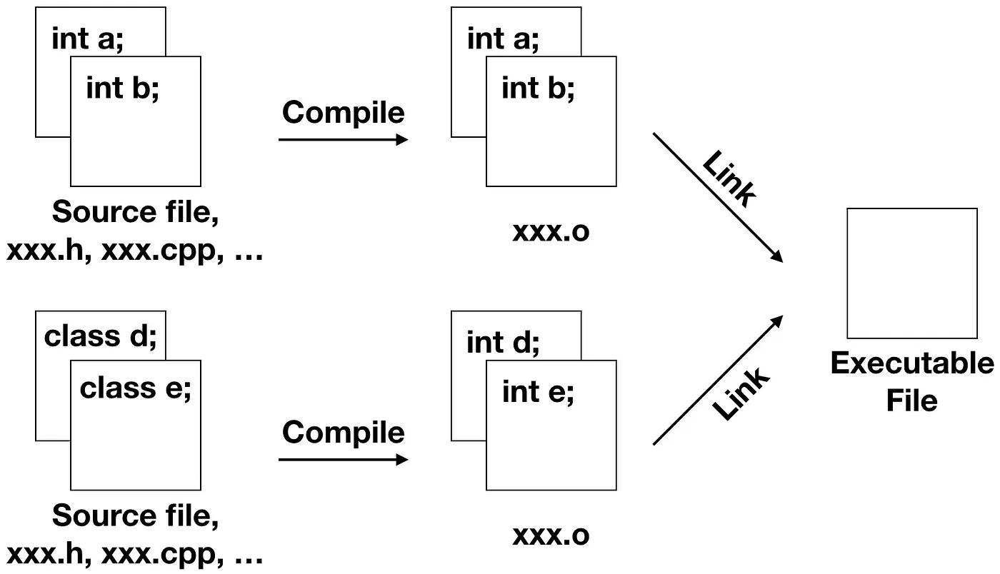

# C++ 函式
## **目錄**
---
1. [C++ 函式基礎](#1-c-函式基礎)
2. [C++ 引數與參數](#2-c-引數與參數)
3. [C++ 不定長度引數](#3-c-不定長度引數)
4. [C++ 傳回值](#4-c-傳回值)
5. [C++ 函式模板](#5-c-函式模板)
6. [C++ 函式模板不定長度引數](#6-c-函式模板不定長度引數)
7. [C++ 函式模板尾端傳回型態](#7-c-函式模板尾端傳回型態)
8. [C++ 函式指標](#8-c-函式指標)
9. [C++ lambda運算式](#9-c-lambda運算式)
---  
<br/>  

## **1. C++ 函式基礎**  
函式的組成主要包括四個部份：返回值、函式名稱、參數列與函式主體
> C++ 中規定，如果函式是在 main 之後實作，必須在 main 之前進行宣告，否則會出現編譯錯誤。

此外，函式也可以透過建立標頭檔（math.h）、實作（math.cpp）來引入（main.cpp）函數，程式碼如下：
```c++
// math.h
int pow2(int); 
int pow(int, int);

// math.cpp
#include "math.h"
int pow2(int num) { 
    return num * num; 
} 
int pow(int n, int p) { 
    int r = 1; 
    for(int i = 0; i < p; i++) {
        r *= n;
    }
    return r; 
}

// main.cpp
#include <iostream>
#include "math.h"
using namespace std;
int main() {
    int num = 0;
    int power = 0; 
    cout << "輸入數值："; 
    cin >> num; 
    cout << "輸入次方："; 
    cin >> power; 
    cout << num << " 平方：" << pow2(num) << endl
         << num << " 的 " << power << " 次方：" 
         << pow(num, power) 
         << endl; 
    return 0;
}
```
> 由於 Visual Studio Code 的 Code Runner 預設只編譯執行一個程式檔案，因此切換到 TERMINAL ，接著將 math.cpp 與 main.cpp 分別編譯成中間過程檔（.o），最後再將所有中間過程檔連結成執行檔。  
>    `g++ -c math.cpp`  
>    `g++ -c main.cpp`  
>    `g++ -o main main.o math.o`  
>    `./main.exe`  
> 
>

由於透過上方呼叫函式時會造成額外的資源負擔，因此可以「建議」編譯器設為 __inline__ 行內，若建議被採納，該函式會自動在呼叫點展現為程式碼（inline 函式通常直接在標頭檔中實作），而不是待編譯器需要其實作時才展開函式呼叫。
```c++
// math.h
inline int pow2(int num) { 
    return num * num; 
}
int pow(int, int);
```
> inline 函式只能建議編譯器，建議不一定被採納，例如遞迴函式無法在呼叫點展開，數千行的函式也不適合在呼叫點展開，如果編譯器拒絕將函式展開，會視為一般函式進行編譯，inline 的建議會被忽略。

而當如果函式夠簡單，簡單到編譯器可以推斷出傳回值，可以使用 __constexpr__ 修飾，呼叫這類函式時，若能推斷出值，編譯器就會用值來取代呼叫。
```c++
// math.h
constexpr int addOne(int n) {
    return n + 1;
}

// 編譯器直接推斷的 101 會取代 addOne 呼叫，也就是 constexpr int r = 101 來進行編譯
constexpr int r = addOne(100);
```
> 使用 constexpr 修飾的函式，通常寫在標頭檔中。

__函式重載（Overload）__，為類似功能的函式提供了統一名稱，透過參數列個數或型態的不同，由編譯器選擇要呼叫的函式。注意！傳回型態不能作為重載的依據。


```c++
int main() { 
    foo(10); 
    foo(20, 30); 

    return 0; 
} 

void foo(int x) { 
    cout << "引數：" << x << endl; 
} 

void foo(int x, int y) { 
    cout << "引數：" << x << " " << y << endl; 
}
```

__遞迴（Recursion）__ 是在函式中呼叫自身，呼叫者會先置入記憶體堆疊，被呼叫者執行完後，再從堆疊取出被置入的函式繼續執行。

> 開發者很容易在迴圈執行過多的任務，令迴圈難以閱讀、理解與維護，特別是令那些本質上可以分而治之的任務，難以抽取、平行化，或者令原始碼本質上其實重複的流程，難以辨識出來，進而使用迴圈來避免這些問題。
> 然而，遞迴函式會在記憶體中堆疊，語言會有堆疊的數量限制（可能導致 stack overflow），若遞迴最佳化能展開遞迴，轉為迴圈形式，可以避開這類限制。
<hr/>  

## **2. C++ 引數與參數**  
提供給函式的資料稱為引數（argument），接受引數的稱為參數（parameter）：
```c++
int increment(int n) {
    // n 為參數
    n = n + 1;
    return n;
}

int main() {
    int x = 10;
    // x 為引數
    cout << increment(x) << endl;
    cout << x << endl;

    return 0;
}
```

C++ 預設引數可以在上方宣告函式原型時事先定義：
> 預設引數一旦出現在參數列，右邊的參數也必須設定預設引數，在使用預設引數時，必須注意配置順序；允許多次定義預設引數。
```c++
double area(double, double pi = 3.14159); 

int main() { 
    double r, pi; 

    cout << "輸入半徑與 PI: "; 
    cin >> r >> pi; 

    cout << "面積（自訂 PI）：" << area(r, pi) << endl
         << "面積（default）：" << area(r) << endl;

    return 0; 
} 

double area(double r, double pi) { 
    return r*r*pi; 
}
```

函式呼叫主要可分為傳值、傳址以及傳參考。
1. 傳值是指新增一塊全新記憶體位置給帶入引數值的參數，無關原本引數的記憶體位置。
    ```c++
    void swap(int x,int y) {
        int temp; 
        temp = x ; 
        x = y ; 
        y = temp ; 
    }
    ```
2. 傳址是指傳遞引數的記憶體位置，使函式內部可以修改引數的值。
    ```c++
    void swap(int *x,int y) {
        int temp; 
        temp = *x ;
        *x = *y ;
        y = temp ; 
    }
    ```
3. 傳參考與傳址在傳遞記憶體位址很類似，不過比較節省一點記憶體空間。
    ```c++
    void swap (int &x , int &y){ 
    　　　int temp = x; 
    　　　x = y;
    　　　y = temp;
    }
    ```
> 1. C++ 支援三種，C 和 Java 支援前兩種。  
> 2. 雖然JAVA把其中一種資料型態系統的名稱命名為reference type，但事實上它卻是使用pass by address。  
> 3. 因為JAVA的開發者們認為把操作記憶體的方式分成3種太過複雜了，而且在JAVA開發的年代記憶體已經愈來愈便宜，硬體效能愈來愈強，所以JAVA的開發者們覺得不支援pass by reference並不會造成什麼問題，而且他們認為pass by address的觀念反而更像真正的pass by reference
<hr/>  

## **3. C++ 不定長度引數**  
C++ 可以使用 C 風格的不定長度引數（但不建議），引入cstdarg 標頭檔
```c++
#include <iostream> 
#include <cstdarg> 
using namespace std; 

void foo(int, ...); 

int main() { 
    foo(3, 1.1, 2.2, 3.3);

    return 0; 
} 

void foo(int size, ...) { 
    va_list args; // 一個特殊的型態（type），在 va_start、 va_arg 與 va_end 三個巨集（macro）中當作參數使用。
    va_start(args, size); // 啟始不定長度引數的巨集，第一個引數是 va_list，第二個引數是最後一個具名參數。

    for(int i = 0; i < size; i++) {
        cout << va_arg(args, double) << endl; // 讀取不定長度引數的巨集。
    }

    va_end(args); // 終止不定長度引數的巨集。
}
```

當然也可以透過 vector 將參數 push 到 vector 後在傳入函式中。
```c++
#include <iostream>
#include <vector> 
using namespace std; 

void foo(vector<double>); 

int main() { 
    vector<double> args;

    args.push_back(1.1);
    args.push_back(2.2);
    args.push_back(3.3);

    foo(args);

    return 0; 
} 

void foo(vector<double> args) { 
    for(auto arg : args) {
       cout << arg << endl; 
    } 
}
```

C++ 中也透過可變參數模版（variadic template）來定義，initializer_list 定義於 initializer_list 標頭檔。
> 相較於 vector ，清單初始化 {} 會建立 initializer_list，而 vector 不過就是有個建構式，可以接受 initializer_list，才令 vector 也可以使用清單初始化。簡單來說，只是想定義不定長度引數時，initializer_list 就可以了，不過它包含的方法比較少。
```c++
#include <iostream>
#include <initializer_list> 
using namespace std; 

void foo(initializer_list<double>); 

int main() { 
    foo({1.1, 2.2, 3.3});

    return 0; 
} 

void foo(initializer_list<double> args) { 
    for(auto arg : args) {
       cout << arg << endl; 
    } 
}
```

<hr/>  

## **4. C++ 傳回值**  
定義函式時，必須定義傳回值型態，如果函式不傳回值，使用 void 表示不傳回任何數值；若定義了傳回值型態不為 void，函式最後要使用 return 傳回數值，否則編譯器失敗。

如果傳回位址，那麼傳回值型態可定義為指標型態，這代表著記憶體位址在函式執行完畢後，必須仍是有效的，也就是說這通常代表著，函式內動態配置記憶體。 

> 如果不是動態配置記憶體，代表傳回指標隨著函式結束而結束，傳回的指標沒有意義，可能導致存取錯誤。
```c++
// 傳回指標
int* makeArray(int m, int initial = 0) { 
    int *a = new int[m]; 
    for(int i = 0; i < m; i++) {
        a[i] = initial; 
    }
    return a; 
}
```
同樣，不應將區域變數以 lvalue 參考（&）傳回，或者將常量以 rvalue 參考（&&）傳回，因為函式執行完畢後，區域變數、常量的記憶體就會被回收了。 
```c++
// 錯誤示範-傳回區域參考
int& showError() {
    int a = 5;
    int &r = a;
    return r;
}
```
下列為傳回 lvalue 或 rvalue 參考程式碼：
> 儘管第二個函式中，lhs 型態是右值引用，但在函數内部右值引用仍會被當作左值引用来對待，因此需要使用 std::move 来將他轉換為右值引用。

> 此外，在函數内部右值引用如果要將此 rvalue 參考傳遞給另一個函式（不同於上方的回傳），則需使用 std::forward ，來告訴編譯器，將呼叫時運算式來源的資訊轉給接收的那方。

```C++
// 傳回 lvalue 參考 
// 此處如果傳回不用參考，接收回傳值時需要額外使用變數去接（產生 string 內容不必要的複製）、或者rvalue reference去接。因為回傳的string 是暫存的、不是有名稱的物件）
// 例如：string &&s3 = longerStr(s1, s2); <-不使用參考的話
string& longerStr(string &s1, string &s2) {
    return s1.length() > s2.length() ? s1 : s2;
}

// 傳回 rvalue 參考 [std::move]
string&& concat(string &&lhs, string &rhs) {
    lhs += rhs;
    return std::move(lhs);
}
// 轉傳 rvalue 參考 [std::forward]
void foo(int &&p) {
    //...
}

template <typename T>
void some(T &&t) {
    foo(std::forward<T>(t));
}
```
<hr/>  

## **5. C++ 函式模板**  
函式模版（function template），或稱為泛型函式（generic function）。

當多數函數行為相同，只有參數型態不同時，可以使用模板來提升效率。也就是參數的型態可以於呼叫實在指定。
```c++
template <typename T>
bool greaterThan(T a, T b) {
    return a > b;
}

int main() { 
    // 顯示 0
    cout << greaterThan(10, 20) << endl;
    // 顯示 1
    cout << greaterThan(string("xyz"), string("abc")) << endl;
    return 0; 
} 
```

而當模板鍾某情況需要自己定義時，可用：
```c++
template <typename T>
bool greaterThan(T a, T b) {
    return a > b;
}

template <>
bool greaterThan(string s1, string s2) {
    return s1.size() > s2.size();
}

int main() { 
    cout << greaterThan(10, 20) << endl;
    cout << greaterThan(string("xyz"), string("abc")) << endl;

    return 0; 
} 
```

函式模板一樣可以處裡陣列：
```c++
// 此 L 為模版的非型態參數（nontype parameter）其必須是個常數運算式，也就是靜態時期可決定的值。
template <typename T, int L>
void printAll(T (*arr)[L]) {
   for(auto elem : *arr) {
       cout << elem << " ";
   }
   cout << endl;
}

int main() { 
    int arr1[] = {1, 2};
    int arr2[] = {3, 4, 5};

    printAll(&arr1);
    printAll(&arr2);

    return 0; 
} 
```

結合參考可以寫成以下：
```c++
// 此處 T 會被推斷為 int [2]
template <typename T>
void printAll(T &arr) {
   for(auto elem : arr) {
       cout << elem << " ";
   }
   cout << endl;
}

int main() { 
    int arr1[] = {1, 2};
    int arr2[] = {3, 4, 5};

    printAll(arr1);
    printAll(arr2);

    return 0; 
} 
```

上方的範例傳入模板參數是 lvalue的版本，然而傳入值其實也可以是 rvalue ，因為在 C++ 中有一個特例，如果將 lvalue 傳給模版函式的 T&& 參數的話，T 會被推斷為 int&，如下方：
```c++
void foo(int &p) {
    p = 10;
}

template <typename T>
void some(T &&t) {
    foo(t);
}

int main() {
    int x = 5;
    some(x);
    some(10);
    cout << x << endl;
    return 0; 
}
```
<hr/>  

## **6. C++ 函式模板不定長度引數**
C++ 11 以後可以透過可變參數模版（variadic template）來解決引數數量、型態不同時的函式模板。
```c++
// Types 被稱為模版參數包（template parameter pack）
template <typename... Types>
// params 被稱為函式參數包（function parameter pack）
void foo(Types... params) {
    // 使用 sizeof... 來得知實際呼叫時的型態數量或引數數量
    cout << sizeof...(Types) << " "
         << sizeof...(params) << endl;
}

int main() { 
    foo(1);             // 顯示 1 1
    foo(1, "XD");       // 顯示 2 2
    foo(1, "XD", 3.14); // 顯示 3 3

    return 0; 
} 
```  

如果呼叫時的引數是同一型態，一個簡單的方式是展開為陣列、vector 等型態。
```c++
template <typename T, typename ...Ts>
T sum(T first, Ts... rest) {
    vector<T> nums = {rest...};
    T r = first;
    for(auto n : nums) {
        r += n;
    }
    return r;
}
```

如果實際上傳遞的引數型態各不相同，此時需使用遞迴並配合解開參數包。
```c++
template <typename T>
void print(T p) {
    cout << p << endl;
}

template <typename T, typename ...Ts>
void print(T first, Ts... rest) {
    cout << first << " ";
    print(rest...);
}

int main() { 
    print(1);
    print(1, "2");
    print(1, "2", 3.14);

    return 0; 
} 
```
<hr/>  

## **7. C++ 函式模板尾端傳回型態**
如下方程式碼，如果要在標頭檔宣告函式模板原型，傳回值不能寫 auto 因為沒有沒有程式碼上下文，無法判斷。此時便需要使用尾端傳回型態（tailing return type）。
> 不使用 decltype(*begin) 是因為 *begin 是個 lvalue，若迭代器中的元素型態是 E，那 decltype(*begin) 會推斷出 E&，這樣的話，傳回型態會參考區域變數 r，然而函式執行完後 r 就無效了，因此不能使用 decltype(*begin)；這邊需要的是個 rvalue，以令其推斷出 E，因此使用 decltype(*begin + *end)。推斷出 E 原因是在這個特定的表達式中，並沒有涉及到引用。*begin 和 *end 被解引用後直接得到 E （整數值），所以 decltype(*begin + *end) 被推斷為 E （整數型態）。  

> 當你使用 decltype(*begin) 這個表達式時，它會幫助你找出迭代器 begin 指向的元素的類型。假設這個元素是一個整數（int），那麼這個表達式會推斷出這個元素的類型是整數的引用（int&），而不僅僅是整數。這是因為迭代器指向的元素是通過引用方式獲取的，而不是直接的數值。
```c++
template <typename T>
auto addThese(T begin, T end) {
    auto r = *begin;
    for(auto it = begin + 1; it != end; it++) {
        r += *it;
    }
    return r;
}
// 尾端傳回型態
template <typename T>
auto addThese(T begin, T end) -> decltype(*begin + *end);
```
<hr/>  

## **8. C++ 函式指標**
程式在執行時，函式在記憶體中也佔有一個空間。而函式名稱作為指定來源時，函式名稱會自動轉為指標，型態由傳回值型態與參數列決定。
```c++
int foo(int); 

int main() { 
    int (*fp)(int) = foo; 

    foo(10);  // 顯示 10
    fp(20);   // 顯示 20

    return 0; 
} 

int foo(int n) { 
    cout << "n = " << n << endl; 
    return 0; 
}
```

即便是有重載函式，但也因為他們的函式簽名不同，因此編譯器會根據函式指標的型態不同，而呼叫對應的函式：
```c++
int foo(int); 
int foo(int, int);

int main() { 
    int (*fp)(int) = foo; 
    int (*add)(int, int) = foo; 

    foo(10);// 10
    cout << "1 + 2 = " << add(1, 2) << endl;  // 3

    return 0; 
} 

int foo(int n) { 
    cout << "n = " << n << endl; 
}

int foo(int a, int b) { 
    return a + b;
}
```

函是指標主要用來傳遞函式，除了函式指標宣告，也可以利用 typedef、using 或者 decltype。
```c++
// 函式原型
void sort(int*, int, bool (*compare)(int, int));
bool ascending(int, int);
bool descending(int, int);

// 函式原型 + typedef
typedef bool (*CMP)(int, int);

void sort(int*, int, CMP);
bool ascending(int, int);
bool descending(int, int);

// 函式原型 + using
using CMP = bool (*)(int, int);

void sort(int*, int, CMP);
bool ascending(int, int);
bool descending(int, int);

// 函式原型 + decltype
bool cmp(int, int);

void sort(int*, int, decltype(cmp));
bool ascending(int, int);
bool descending(int, int);
```

函是指標可以結合陣列形成函是指標陣列：
```c++
bool (*compare[10])(int, int) = {nullptr};
// 使用 using 呼叫
using CMP = bool (*)(int, int);
CMP compare[10] = nullptr;
// 使用 decltype 呼叫
bool cmp(int, int);
decltype(cmp) *compare[10] = {nullptr};
```

此外，C++ 也提供 Callable 物件，定義於functional 標頭檔，其支援函式指標。
```C++
void sort(int*, int, function<bool(int, int)>);
bool ascending(int, int);

int main() { 
    sort(number, 5, ascending);
}
void swap(int &a, int &b) {
    int t = a; 
    a = b; 
    b = t;
}
bool ascending(int a, int b) {
    return a < b;
}
void sort(int* arr, int length, function<bool(int, int)> compare) { 
    for(int flag = 1, i = 0; i < length - 1 && flag == 1; i++) { 
        flag = 0; 
        for(int j = 0; j < length - i - 1; j++) { 
            if(compare(arr[j + 1], arr[j])) { 
                swap(arr[j + 1], arr[j]); 
                flag = 1; 
            } 
        } 
    } 
}
```
<hr/>  

## **9. C++ lambda運算式**
C++可以使用 lambda 運算式，其在函式中封裝一段演算流程進行傳遞
> lambda 運算式定義了一個 Callable 物件，也就是個可以接受呼叫操作的物件。  

> 而且其會建立一個匿名類別（稱為 closure type）的實例，因為無法取得匿名類別的名稱，也就無法宣告其型態，因而大多使用 auto 來自動推斷，此外也可以利用 function 來宣告。
```c++
// lambda 定義
// [ captures ] ( params ) -> ret { body }
auto print = [](int n) -> void { cout << n << " "; };
// [ captures ] ( params ) { body }
// 沒有定義 ret 的型態時，會自動推斷
auto print = [](int n) { cout << n << " "; };
// [ captures ] { body }
auto print = []{ cout << "hello"; };
// 改以 function 宣告（當遇到某些函式參數無法使用 auto 時）
function<void(int)> print = [](int n) { cout << n << " "; };
```

lambda 運算式也可被指定給函式指標
```c++
void (*f)(int) = [](int n) { cout << n << " "; };
```

lambda 運算式前方的 [capture] ，代表其是否有運用到外部變數：
+ [=]：lambda 運算式本體可以取用外部變數。
+ [&]：lambda 運算式本體可以參考外部變數。
+ [x, y]：以 = 的方式取用外部的 x、y。
+ [x, &y]：以 = 取用外部的 x，以 & 的方式參考外部的 y。
+ [=, &y]：以 & 的方式參考外部的 y，其餘外部變數取用時都是 = 的方式。
+ [&, y]：以 = 的方式參考外部的 y，其餘外部變數以 & 的方式參考。
> [=] 其實是隱含的建立區域變數，其值預設不能修改，欲修改須加上 mutable 詞。
```c++
#include <iostream> 
using namespace std; 

int main() { 
    int x = 10;

    auto f = [=]() mutable -> void {
        x = 20;
        cout << x << endl;
    };

    f(); // 顯示 20
    cout << x << endl; // 顯示 10

    return 0; 
} 
```

lambda 運算式也可以模版化：
```c++
template <typename T>
function<T(T)> negate_all(T t1) {
    return [=](T t2) -> T {
        return t1 + t2;
    };
}
int main() { 
    int x = 5;
    cout << negate_all(x)(4); // 9
} 
```
