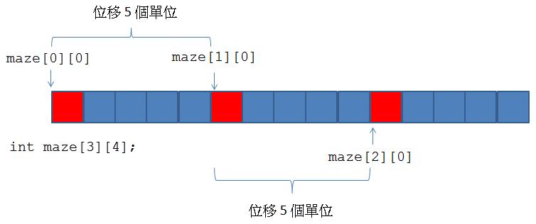

# C++ 陣列
## **目錄**
---
1. [C++ 陣列/多維陣列](#1-c-陣列多維陣列)
2. [C++ 字元陣列/字串](#2-c-字元陣列字串)
3. [C++ array/vector/string](#3-c-arrayvectorstring)
---  
<br/> 

## **1. C++ 陣列/多維陣列**  
陣列是連續的空間配置。陣列在使用時，得知陣列長度是必要的，不可以存取超過陣列長度的記憶體，這會發生無法預期的結果

由於陣列的元素值是未初始的，若想在宣告時初始陣列全部的元素值（若在宣告陣列時指定各個索引處的的值，可以不用宣告陣列元素大小）：
```c++
int number[10] = {0}; //全部為0
double score[] = {87.0, 78.0, 99.5, 69.5, 82.5};
char ascii[10] = {'\0'}; 
bool flag[10] = {false};
```
宣告陣列時，不可以將陣列直接指定給另一陣列。此外，如果使用 const 或 constexpr 來修飾陣列，每個索引位置就成為唯讀。

如欲存取陣列中的元素值時，透過下標（Subscript）運算子 [] 加上索引」，注意索引值是由 0 開始。

C++ 提供 begin 與 end 函式，begin 會傳回陣列首個元素的 __位址__，end 傳回最後一個元素 __下個位置的位址_。兩者型態會是 int*，儲存的是位址。當對位址值進行運算時，會以資料型態的長度偏移
```c++
int number[5] = {0, 1, 2, 3, 4};

for(auto offset = begin(number); offset != end(number); offset++) {
    auto n = *offset;
    cout << n << " "; 
}
```

C++ 陣列如要進行排序、尋找、反轉等操作，可以使用包含 algorithm 標頭檔進行操作（array、vector 有可使用）：
```c++
#include <algorithm>
using namespace std; 

int main() { 
    int number[] = {30, 12, 55, 31, 98, 11};

    // 排序 
    sort(begin(number), end(number));
    for(auto n : number) {
        cout << n << " ";
    }

    //搜尋
    int search = 55;
    int* addr = find(begin(number), end(number), search);
    cout << (addr != end(number) ? "找到" : "沒有");

    // 反轉 
    reverse(begin(number), end(number));
    for(auto n : number) {
        cout << n << " ";
    }

    return 0; 
}
```

二維陣列中，第一個 [] 用來指定存取的列，第二個 [] 是用來指定存取的行。

宣告二維陣列同時初始化：
```c++
int maze[2][3] = {{1, 2, 3},{4, 5, 6}};
```

而二維陣列於記憶體中的配置方式與一維一樣，是指相對於陣列第一個元素的位移量，而多維陣列，也是同樣以此類推。



可以透過 for-range 來取循序取值，注意 row 的型態實際上是 int*
```c++
for(auto &row : maze) {
    for(auto n : row) {
        cout << n << "\t"; 
    }
    cout << endl; 
} 
```
<hr/>

## **2. C++ 字元陣列/字串**

C++ 中字串是指字元組成的陣列，最後加上一個空（null）字元 '\0'。
```c++
char text[] = {'h', 'e', 'l', 'l', 'o', '\0'};
char text[] = "hello";
```

C++ 中若字串中包含 \、" 等字元，除了會需要轉義（加反斜線）也可以使用原始字串常量 R"(...)" 的寫法，在括號中的文字無需轉義，也可以直接撰寫 "：
```c++
char text1[] = R"(c:\workspace\exercise)";
char text2[] = R"(This is a "test")";
```

__以下各類方法，需引入C++ 標頭檔 `#include <cstring>`。__   
若要得知字串所含 __字元長度__（不包括空字元），則可以使用 __strlen__ 函式：  
```c++
size_t strlen( const char *str );
```

若要進行 __字串複製__，可以使用 __strcpy__ 函式，若要複製字串中若干字元內容，可以使用 __strncpy__：
```c++
char *strcpy( char *restrict dest, const char *restrict src );
char *strncpy( char *restrict dest, const char *restrict src, size_t count );
```

若要 __串接兩個字串__，則要使用 __strcat__，若要串接部份字串，可以使用 __strncat__：
```c++
char *strcat( char *restrict dest, const char *restrict src );
char *strncat( char *restrict dest, const char *restrict src, size_t count );
```

若要進行 __字串的比較__，可以使用 __strcmp__ 或 __strncmp__。  
字串 str1 與 str2 的大小若相同就傳回 0，str1 大於 str2 則傳回大於 0 的值，小於則傳回小於 0 的值，比較的標準是依字典順序，例如若 str1 大於 str2，表示 str1 在字典中的順序是在 str2 之後。
```c++
int strcmp( const char *lhs, const char *rhs );
int strncmp( const char *lhs, const char *rhs, size_t count );
```

若要進行 __搜尋字串__，可以使用 __strstr__ 函式。  
第一個參數是被搜尋字串，第二個參數是想要搜尋的子字串，如果沒找到子字串則傳回 NULL，如果搜尋到第一個 __符合__ 的子字串，則傳回符合位置的指標。
```c++
char *strstr( const char* str, const char* substr );
```

__strspn__ 函式則用來 __搜尋字串__，找出兩個字串中開始 __不匹配__ 的地方：
```c++
size_t strspn( const char *dest, const char *src );
```

__strchr__ 函式找出字串中的 __指定字元第一次出現__ 的指標，若找到則回傳，否則傳回 NULL。
```c++
char *strchr( const char *str, int ch );
char *strrchr( const char *str, int ch );
```

__strcspn__ 函式則是找出一個字串中與另一個字串 __任何字元第一次匹配的索引位置__，若無則傳回字串長度：
```c++
size_t strcspn( const char *dest, const char *src );
```

C++ 中字串轉換為數字，可以使用 atof、atoi、atol、atoll 等函式，這些函式都包括在 `#include <cstdlib>` 中：
```c++
double    atof( const char* str );
int       atoi( const char *str );
long      atol( const char *str );
long long atoll( const char *str );
```
<hr/>  

## **3. C++ array/vector/string**
C++ 中建議使用 array 來替代陣列，使用 vector 容器來儲存可變長度資料，使用 string 來表現字串。

### __array：__
引入標頭檔：`#include <array>`。  

宣告及初始化 array：
```c++
array<int, 5> number;
array<int, 3> id = {0};    // 全部初始為 0
array<int, 3> number = {10, 20, 30};
array<double, 3> score{85.5, 78.2, 63.0};
array<int, 3> a1 = {10, 20, 30};
array<int, 3> a2(a1); // 透過a1 作為引數來建構 a2
```

如果想要循序地走訪 array 中的元素，可以使用 for range 語法，或者透過 [] 指定索引可以存取特定位置的元素，或者可以使用 begin 以及 end 方法（不建議將 begin、end 方法的傳回值看成是指標，而建議將之看成迭代器）。
```c++
array<int, 3> number = {10, 20, 30};
for(array<int, 5>::iterator it = number.begin(); it != number.end(); it++) {
    auto n = *it;
    cout << n << endl;
}
```

如果打算對 array 進行排序、尋找、反轉等操作，可以使用包含 algorithm 標頭檔：`#include <algorithm>`

### __vector：__
引入標頭檔：`#include <vector>`。  

宣告及初始化 array：
```c++
vector<int> number;
vector<int> number = {10, 20, 30};
vector<double> score{85.5, 78.2, 63.0};
vector<int> v1(10); //建立長度為 10 的 vector，元素初值都是 0
vector<int> v2(10, 5); //建立長度為 10 的 vector，元素初值都是 5
vector<int> v3 = {10, 20, 30, 40, 50};
vector<int> v4(v3.begin() + 2, v3.end()); // 包含 30, 40, 50
```

如果想要循序地走訪 array 中的元素，可以使用 for range 語法，或者透過 [] 指定索引可以存取特定位置的元素，或者可以使用 begin 以及 end 方法。

vector 中可以透過 __size__ 方法得知元素的個數，__empty__ 方法可以得知是否為空，__front__ 方法可以取得第一個元素，__back__ 方法可以取得最後一個元素，想要新增元素，可以使用 __push_back、insert__ 方法，想取出最後一個元素可以用 __pop_back__，__clear__ 可以清空 vector 等。

如果打算對 array 進行排序、尋找、反轉等操作，可以使用包含 algorithm 標頭檔：`#include <algorithm>`


### __string：__
引入標頭檔：`#include <string>`。 

宣告及初始化：
```c++
string str1;                 // 內容為空字串
string str2("caterpillar");  // 內容為指定的字串常量
string str3(str2);           // 以 str1 實例建立字串
string str4 = "Justin";      // 內容為指定的字串常量
```

如果想要循序地走訪 array 中的元素，可以使用 for range 語法，或者透過 [] 指定索引可以存取特定位置的元素，

string 可以使用 __size()__ 或 __length()__ 來取得字串長度，使用 __empty()__ 測試字串是否為空，使用 __==__ 比較兩個字串的內容是否相同，使用 __+__ 運算子來串接字串  
